# Legacy

This repository contains my legacy projects and notes from old github accounts. 

I moved them here for archival purposes.

## Projects

### Solutions to Codewars Katas
* [Completion Summary](#completion-summary)
* [Go](#go)
* [SQL](#sql)
* [Shell](#shell)

### Notes for Data Structure in Golang by Junmin Lee
* [Linked List](#linked-list)
* [Stack](#stacks)
* [Queue](#queues)
* [Binary Search Tree](#binary-search-tree)
* [Trie](#tries)
* [Hash Table](#hash-tables)
* [Heap](#heap)
* [Graph](#graph)
* [Pointer](#pointers)
* [Garbage Collector](#garbage-collector)

##  Solutions to Codewars Katas 

<a href = "https://www.codewars.com/users/goldennovember"> </a>

My solutions to Codewars challenges for Go, SQL and Shell.

> <p style = "color:red"><strong>Note:</strong> Please DO NOT look at my solutions or use them as your own submissions before you've solved them or at least spent some time thinking about the approaches</p>

### Completion Summary

| Rank  | Level                      | ✔️[Go](codewars-go) | ✔️[SQL](codewars-sql) | ✔️[Shell](codewars-shell) |
|-------|----------------------------|------------|--------------|------------------|
| 8 Kyu | :white_circle: Beginner    | 53/89      | 6/49         | 2/29             |
| 7 Kyu | :red_square:  Beginner     | ---------  | ---------    | ---------        |
| 6 Kyu | :yellow_heart:  Novice     | 1/226      | ---------    | ---------        |
| 5 Kyu | :large_blue_circle: Novice | 1/134      | ---------    | ---------        |
| 4 Kyu | :red_circle: Competent     | ---------  | ---------    | ---------        |
| 3 Kyu | :red_circle: Competent     | ---------  | ---------    | ---------        |
| 2 Kyu | :black_circle: Proficient  | ---------  | ---------    | ---------        |
| 1 Kyu | :black_circle: Proficient  | ---------  | ---------    | ---------        |
| All   | :star: All                 | 55/671     | 6/169        | 2/189            |

The Language Version for SQL is `PostgreSQL` and for Shell is `bash`

### Go

Go solution for Codewars Kata

#### 8 Kyu
* [1. Multiply](codewars-go/multiply.go)
* [2. Sum of Positive](codewars-go/sum-of-positive.go)
* [3. Even or Odd](codewars-go/even-or-odd.go)
* [4. Return Negative](codewars-go/return-negative.go)
* [5. Reversed String](codewars-go/reversed-string.go)
* [6. Convert boolean values to strings](codewars-go/convert-boolean-values.go)
* [7. Opposite](codewars-go/opposite.go)
* [8. Number to a String](codewars-go/number-to-string.go)
* [9. Remove First and Last Character](codewars-go/remove-char.go)
* [10. String repeat](codewars-go/string-repeat.go)
* [11. Square(n) Sum](codewars-go/square-sum.go)
* [12. Grasshopper - Summation](codewars-go/remove-string-spaces.go)
* [13. Remove String Spaces](codewars-go/grasshopper-summation.go)
* [14. Smallest integer in the array](codewars-go/smallest-integer.go)
* [15. Counting sheep](codewars-go/ounting-sheep.go)
* [16. Century From Year](codewars-go/century-from-year.go)
* [17. Abbreviate a Two Word Name](codewars-go/abbreviate-name.go)
* [18. Keep Hydrated!](codewars-go/keep-hydrated.go)
* [19. Is n divisible by x and y?](codewars-go/is-divisible.go)
* [20. String to a Number](codewars-go/string-to-number.go)
* [21. Number to reversed array of digits](codewars-go/number-to-reversed-digits.go)
* [22. Beginner - Lost Without a Map](codewars-go/lost-without-map.go)
* [23. Returning Strings](codewars-go/returning-strings.go)
* [24. Function 1 - hello world](codewars-go/hello-word.go)
* [25. Beginner Series #2 Clock](codewars-go/past-clock.go)
* [26. Opposites Attract](codewars-go/opposite-attract.go)
* [27. Count of positives / sum of negatives](codewars-go/count-pos-sum-neg.go)
* [28. Reversed sequence](codewars-go/reversed-sequence.go)
* [29. Beginner - Reduce but Grow](codewars-go/reversed-sequence.go)
* [30. Fake Binary](codewars-go/fake-binary.go)
* [31. Reversed Words](codewars-go/reversed-words.go)
* [32. Make Upper Case](codewars-go/make-upper-case.go)
* [33. Jenny's secret message](codewars-go/jenny-secret-message.go)
* [34. Is he gonna survive?](codewars-go/is-he-gonna-survive.go)
* [35. DNA to RNA Conversion](codewars-go/dna-to-rna.go)
* [36. If you can't sleep, just count sheep!!](codewars-go/count-sheep.go)
* [37. Count by X](codewars-go/count-by-x.go)
* [38. What is between?](codewars-go/what-is-between.go)
* [39. Convert a string to an array](codewars-go/string-to-array.go)
* [40. Rock Paper Scissors!](codewars-go/rock-paper-scissors.go)
* [41. Total amount of points](codewars-go/otal-points.go)
* [42. Count the Monkeys!](codewars-go/count-mokeys.go)
* [43. Powers of 2](codewars-go/powers-of-two.go)
* [44. Messi goals function](codewars-go/messi-goals-function.go)
* [45. Count Odd Numbers below n](codewars-go/odd-numbers-below-n.go)
* [46. Do I get a bonus?](codewars-go/do-i-get-a-bonus.go)
* [47. Twice as old](codewars-go/twice-as-old.go)
* [48. Check for factor](codewars-go/check-for-factor.go)
* [49. Get Planet Name by ID](codewars-go/planet-name-by-id.go)
* [50. Find Multiples of a Number](codewars-go/find-multiple-of-a-number.go)
* [51. You Can't Code Under Pressure #1](codewars-go/under-pressure.go)
* [52. Sum Mixed Array](codewars-go/sum-mixed-array.go)
* [53. Grade book](codewars-go/grade-book.go)
* [54. Make the Deadfish Swim](codewars-go/deadfish-swim.go)
* [55. Moving Zeros To The End](codewars-go/move-zero-to-the-end.go)

### SQL

SQL solution for Codewars Kata

* [1. Quarter of the year](codewars-sql/quarter-of-the-year.sql)
* [2. Even or Odd](codewars-sql/even-or-odd.sql)
* [3. Grasshopper - Summation](codewars-sql/grasshoper-summation.sql)
* [4. Multiply](codewars-sql/multiply.sql)
* [5. Reversed Strings](codewars-sql/reverse-strings.sql)
* [6. String repeat](codewars-sql/string-repeat.sql)

### Shell
Shell solution for Codewars Kata

* [1. Even or Odd](codewars-shell/even-or-odd.sh)
* [2. Multiply](codewars-shell/multiply.sh)

This post is based on [Data Structures in Golang by Junmin Lee](https://www.youtube.com/playlist?list=PL0q7mDmXPZm7s7weikYLpNZBKk5dCoWm6)

## Data Structures \[Junmin Lee]

### Linked List

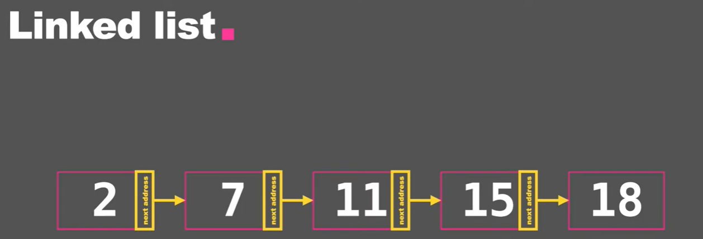

Linked List put the values in nodes. Nodes are linked to each other by containing address of the next nodes.

**Benefits:**

* Adding or removing values at the beginning of the list: **O(1)**. Array need to shift when adding new values.

**Disadvantages**

* Travel and replace the value of the node: **0(n)**, arrays cost just **O(1)**

#### Doubly linked list

Contains the address of the next and also the previous node

#### Implement

```go
package main

import "fmt"

type node struct {
	data int
	next *node
}

type linkedList struct {
	head   *node
	length int
}

func (l *linkedList) prepend(n *node) {
	second := l.head
	l.head = n
	l.head.next = second
	l.length++
}

func (l linkedList) printListData() {
	toPrint := l.head
	for l.length != 0 {
		fmt.Printf("%d ", toPrint.data)
		toPrint = toPrint.next
		l.length--
	}
	fmt.Println("\n")
}

func (l *linkedList) deleteWithValue(value int) {
	if l.length == 0 {
		return
	}
	if l.head.data == value {
		l.head = l.head.next
		l.length--
		return
	}

	previousToDelete := l.head
	for previousToDelete.next.data != value {
		if previousToDelete.next.next == nil {
			return
		}
		previousToDelete = previousToDelete.next
	}
	previousToDelete.next = previousToDelete.next.next
	l.length--
}
func main() {
	mylist := linkedList{}
	node1 := &node{data: 6}
	node2 := &node{data: 5}
	node3 := &node{data: 4}
	node12 := &node{data: 3}
	node22 := &node{data: 2}
	node32 := &node{data: 1}
	mylist.prepend(node1)
	mylist.prepend(node2)
	mylist.prepend(node3)
	mylist.prepend(node12)
	mylist.prepend(node22)
	mylist.prepend(node32)
	fmt.Println(mylist)
	mylist.printListData()
	mylist.deleteWithValue(6)
	mylist.deleteWithValue(7)
	mylist.deleteWithValue(1)
	mylist.printListData()
	emptylist := linkedList{}
	emptylist.deleteWithValue(10)
}
```

```go
{0xc0000522a0 6}
1 2 3 4 5 6 

2 3 4 5
```

### Stacks


* Last in first out (**LIFO**)
* Add: **Push**. Remove: **Pop**

#### Implement

```go
package main

import "fmt"

type Queue struct {
	items []int
}

// Push will add value at the end
func (s *Queue) Push(i int) {
	s.items = append(s.items, i)
}

// Pop will remove a value at the end
// End return the removed value
func (s *Queue) Pop() int {

	// a[low : high]
	// This selects a half-open range which includes the first element, but excludes the last one.
	l := len(s.items) - 1
	toRemove := s.items[l]
	s.items = s.items[:l]
	return toRemove
}

func main() {
	myStack := Queue{}
	myStack.Push(100)
	myStack.Push(200)
	myStack.Push(300)
	fmt.Println(myStack)
	myStack.Pop()
	fmt.Println(myStack)
}
```

```go
{[100 200 300]}
{[100 200]}
```
## Queues

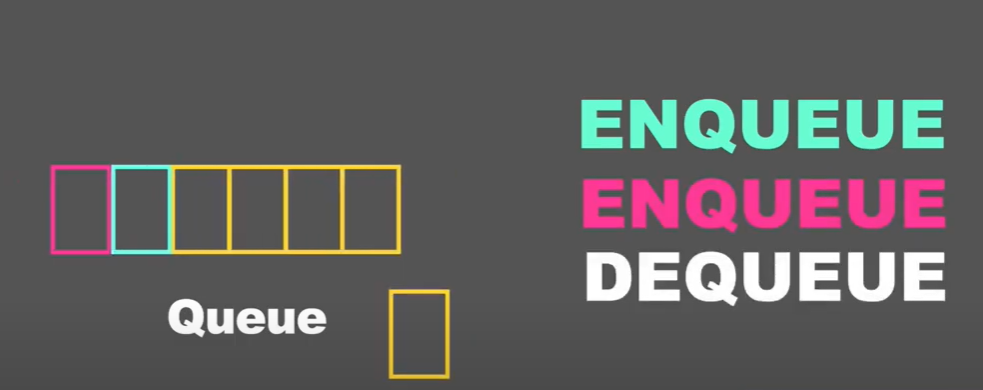

* First in first out
* Add : **Enqueue**. Remove: **Deque**

#### Implement

```go
package main

import "fmt"

type Queue struct {
	items []int
}

// Push will add value at the end
func (q *Queue) Enqueue(i int) {
	q.items = append(q.items, i)
}

// Pop will remove a value at the end
// End return the removed value
func (q *Queue) Deque() int {
	toRemove := q.items[0]
	q.items = q.items[1:]
	return toRemove
}

func main() {
	myQueue := Queue{}
	myQueue.Enqueue(100)
	myQueue.Enqueue(200)
	myQueue.Enqueue(300)
	fmt.Println(myQueue)
	myQueue.Deque()
	fmt.Println(myQueue)
}
```

```go
{[100 200 300]}
{[200 300]}
```

### Binary Search Tree

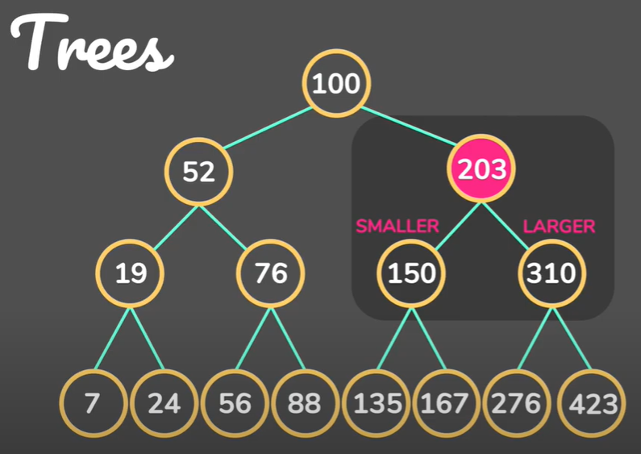

Root -> Parent -> Children -> Leaf

Left Children smaller, Right Children bigger

**Benefits:**

* Speed
* O(logn)
* Worst case still 0(n)

#### Implement

```go
package main

import "fmt"

var count int // Count how many nodes travel

type Node struct {
	Key   int
	Left  *Node
	Right *Node
}

func (n *Node) Insert(k int) {
	if n.Key < k {
		//move right
		if n.Right == nil {
			n.Right = &Node{Key: k}
		} else {
			n.Right.Insert(k)
		}
	} else if n.Key > k {
		//move left
		if n.Left == nil {
			n.Left = &Node{Key: k}
		} else {
			n.Left.Insert(k)
		}
	}
}

// Search will take in a key value
// and Return Trueif there is a node with that value

func (n *Node) Search(k int) bool {
	count++
	if n == nil {
		return false
	}
	if n.Key < k {
		n.Right.Search(k)

	} else if n.Key > k {
		n.Left.Search(k)
	}
	return true
}
func main() {
	tree := &Node{Key: 100}
	tree.Insert(200)
	tree.Insert(50)
	tree.Insert(202)
	tree.Insert(50)
	tree.Insert(24120)
	tree.Insert(525)
	tree.Insert(15)
	tree.Insert(5213)
	tree.Insert(230)
	tree.Insert(5)
	tree.Insert(8)

	fmt.Println(tree)
	fmt.Println(tree.Search(5213))
	fmt.Println(count)
}
```

```go
&{100 0xc0000080a8 0xc000008090}
true
6
```
### Tries

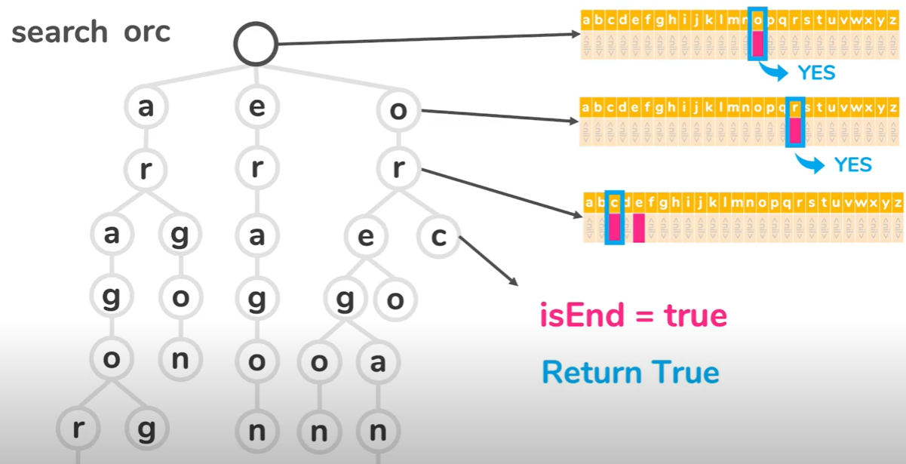

Trees that store words.

Each nodes hold the array of 26 characters.

Time complexity: 0(m), where m is the length of the words/

Return false immediately if the words not in the tree (the first character of the words not in the first parents)

Tries is trade off between Time and Space.

#### Implement

```go
package main

import "fmt"

// AlphabetSize is the numberof possible characters in the trie

const AlphabetSize = 26

type TrieNode struct {
	children [AlphabetSize]*TrieNode
	isEnd    bool
}

// Trie represent a trie and has a pointer to the root node
type Trie struct {
	root *TrieNode
}

func InitTrie() *Trie {
	results := &Trie{root: &TrieNode{}}
	return results
}

// Insert will take in a word and add it to the tries
func (t *Trie) Insert(w string) {
	wordLength := len(w)
	currentNode := t.root
	for i := 0; i < wordLength; i++ {
		charIndex := w[i] - 'a' // 'a' = 97. 'b' - 'a' = 1 => a 0 b 1 c 2 ...
		if currentNode.children[charIndex] == nil {
			currentNode.children[charIndex] = &TrieNode{}
		}
		currentNode = currentNode.children[charIndex]
	}
	currentNode.isEnd = true
}

// Search will take in a word and return TRUE if that word is include in the trie
func (t *Trie) Search(w string) bool {
	wordLength := len(w)
	currentNode := t.root
	for i := 0; i < wordLength; i++ {
		charIndex := w[i] - 'a' // 'a' = 97. 'b' - 'a' = 1 => a 0 b 1 c 2 ...
		if currentNode.children[charIndex] == nil {
			return false
		}
		currentNode = currentNode.children[charIndex]
	}
	if currentNode.isEnd == true {
		return true
	}
	return false // Even will match the word, but the word can continue => not the word we want
}

func main() {
	testTrie := InitTrie()
	fmt.Println(testTrie)      //&{0xc000138000}
	fmt.Println(testTrie.root) // &{[<nil> x26 ] false}
	toAdd := []string{
		"test",
		"next",
		"best",
		"aragon",
		"oregon",
	}

	for _, v := range toAdd {
		testTrie.Insert(v)
	}
	fmt.Println(testTrie.Search("aragon"))
}
```
```go
&{0xc00010e000}
&{[<nil> <nil> <nil> <nil> <nil> <nil> <nil> <nil> <nil> <nil> <nil> <nil> <nil> <nil> <nil> <nil> <nil> <nil> <nil> <nil> <nil> <nil> <nil> <nil> <nil> <nil>] false}
&{[0xc00010ec40 0xc00010e8c0 <nil> <nil> <nil> <nil> <nil> <nil> <nil> <nil> <nil> <nil> <nil> 0xc00010e540 0xc00010f180 <nil> <nil> <nil> <nil> 0xc00010e1c0 <nil> <nil> <nil> <nil> <nil> <nil>] false}
true
```
### Hash Tables


#### Introduction

Search for the name in the array => You have to go through all the array to search for it.

But if you know the index (**hash code**) of the name, for example, 82 for Andy => You can immediately access the name.

When Inserting, but Andy into the **Hash function**, get the hash code, and go to that index to find Andy.

#### Simple Hash Algorithm

RANDY => 82 + 65 + 78 + 68 + 89 (ASCII Code) = 382

382 % 100 = 82.

Choose 100 because is the size of the array we want to store. So the index always between 0 and 99

Eric -> 91.

When we search for STAN, we put into the hash function => get the index and find it in the array

#### Collision Handling

Two name have the same hash code. There are two ways for collision handling

First is **Open Addressing**. We store Andy in index 4 and Eric in index 5. When we search for Eric, we go to the original location, which is 4. If 4 is not Eric, we go to the next index, which is 5. This method still faster than searching each element in the array.

Drawbacks: more and more name in the same address => loose benefit of the hash table.

Second is **Separate Chaining**: Storing multiple names in one slot by using Linked List. Each index will hold a pointer point to the head of a linked list. That has a list of name. The linked list will be called bucket.

#### Insert/Delete/Search

Hash table has the best of array and linked list.

Best case: 0(1) for Insert Delete and Search

Worst Case: 0(n) like a linked list when every element in the same linked list.

#### Implement

```go
package main

import (
	"fmt"
)

// ArraySize is the size of the hash table array

const ArraySize = 7

// HashTable will hold an array

type HashTable struct {
	array [ArraySize]*bucket
}

// bucket is a linked list in each slot of the array

type bucket struct {
	head *bucketNode
}

// bucketNode structure
type bucketNode struct {
	key  string
	next *bucketNode
}

// Insert will take in a key and add it to the hash table array

func (h *HashTable) Insert(key string) {
	index := hash(key)
	h.array[index].insert(key)
}

// Search will take in a key and add it to the hash table array

func (h *HashTable) Search(key string) bool {
	index := hash(key)
	return h.array[index].search(key)
}

// Delete will take in a key and delete it from the hash table

func (h *HashTable) Delete(key string) {
	index := hash(key)
	h.array[index].delete(key)
}

// Init will create a bucket in each slot of the hash table

func Init() *HashTable {
	result := &HashTable{}
	for i := range result.array {
		result.array[i] = &bucket{}
	}
	return result
}

// insert will take in a key, create a node with a key
// and insert the node in the bucket

func (b *bucket) insert(k string) {
	if !b.search(k) {
		newNode := &bucketNode{key: k}
		newNode.next = b.head
		b.head = newNode
	} else {
		fmt.Println(k, "already exists")
	}
}

// search will take in a key and return true if the bucket has that key

func (b *bucket) search(k string) bool {
	currentNode := b.head
	for currentNode != nil {
		if currentNode.key == k {
			return true
		}
		currentNode = currentNode.next
	}
	return false
}

// delete will take in a key and delete the node from the bucket

func (b *bucket) delete(k string) {

	if b.head.key == k {
		b.head = b.head.next
		return
	}
	previousNode := b.head
	for previousNode.next != nil {
		if previousNode.next.key == k {
			previousNode.next = previousNode.next.next
		}
		previousNode = previousNode.next
	}
}

// hash
func hash(key string) int {
	sum := 0
	for _, v := range key {
		sum += int(v)
	}
	return sum % ArraySize
}

func main() {
	testHashTable := Init()
	list := []string{
		"ERIC",
		"KENNY",
		"KYLE",
		"STAN",
		"RANDY",
		"BUTTERS",
		"TOKEN",
	}

	for _, v := range list {
		testHashTable.Insert(v)
	}

	testHashTable.Delete("STAN")
	fmt.Println(testHashTable.Search("STAN"))
	fmt.Println(testHashTable.Search("KYLE"))

	testBucket := &bucket{}
	testBucket.insert("RANDY")
	testBucket.insert("RANDY")
	testBucket.delete("RANDY")
	fmt.Println(testBucket.search("RANDY"))
	fmt.Println(testBucket.search("ERIC"))
}
```
```go
false
true
RANDY already exists
false
false
```
### Heap

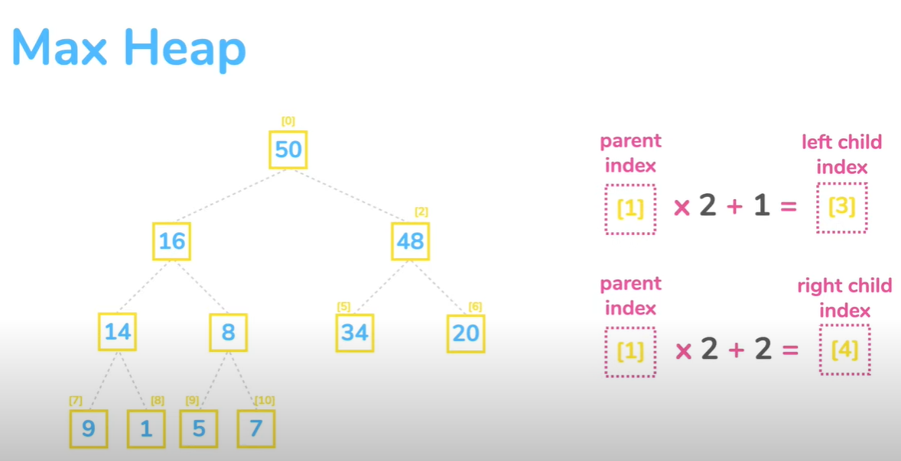

The parent node is larger than a child.

* parent index \* 2 + 1 = left child index.
* parent index \* 2 + 2 = right child index

Very fast when getting the biggest or lowest value (highest node).

#### Insert

When ever insert: add the node to the bottom right of the tree.

#### Heapify

We need to re-arrange the tree by swapping the parent and child nodes if the child node is larger than the parent node. The process of rearranging the indices as **Heapify**.

#### Extract

Extract means remove the highest key of the tree. Right after taking out the highest nodes, we will take the last node of the tree to the root position. Then we swap with its larger child.

#### Time complexity

Heapify up or down is depending on the height of the tree => 0(h) (extract or insert)

If you want to replace to it the number of elements of the array => O(logn) because the height and the number of indices have a logarithmic relation.

#### Implement

```go
package main

import "fmt"

// MaxHeap struct has a slice that holds the array
type MaxHeap struct {
	array []int
}

// Insert adds an element to the heap
func (h *MaxHeap) Insert(key int) {
	h.array = append(h.array, key)
	h.maxHeapifyUp(len(h.array) - 1)
}

// Extract returns the largest key, and removes it from the heap.
func (h *MaxHeap) Extract() int {
	extracted := h.array[0]
	l := len(h.array) - 1

	if len(h.array) == 0 {
		fmt.Print("cannot extract because array length is 0")
		return -1
	}

	h.array[0] = h.array[l]
	h.array = h.array[:l]

	h.maxHeapifyDown(0)
	return extracted
}

// maxHeapifyUp will heapify from bottom top
func (h *MaxHeap) maxHeapifyUp(index int) {
	for h.array[parent(index)] < h.array[index] {
		h.swap(parent(index), index)
		index = parent(index)
	}
}

// maxHeapifyDown will be heapify top to bottom
func (h *MaxHeap) maxHeapifyDown(index int) {

	// loop while index at least one child
	lastIndex := len(h.array) - 1
	l, r := left(index), right(index)
	childToCompare := 0
	for l <= lastIndex {
		if l == lastIndex {
			// when left child is the only child
			childToCompare = l
		} else if h.array[l] > h.array[r] {
			//when left child is larger
			childToCompare = l
		} else {
			// when right child is larger
			childToCompare = r
		}

		// compare array value of current index
		// to larger child and swap if smaller

		if h.array[index] < h.array[childToCompare] {
			h.swap(index, childToCompare)
			index = childToCompare
			l, r = left(index), right(index)
		} else {
			// it means it find the right place
			return
		}

	}
}

// get the parent index
func parent(i int) int {
	return (i - 1) / 2
}

// get the left child index
func left(i int) int {
	return 2*i + 2
}

// get the right child index
func right(i int) int {
	return 2*i + 1
}

// swap keys in the array
func (h *MaxHeap) swap(i1, i2 int) {
	h.array[i1], h.array[i2] = h.array[i2], h.array[i1]
}

func main() {
	m := &MaxHeap{}
	fmt.Println(m)
	buildHeap := []int{10, 20, 30, 5, 7, 9, 11, 13, 15, 17}
	for _, v := range buildHeap {
		m.Insert(v)
		fmt.Println(m)
	}

	for i := 0; i < 5; i++ {
		m.Extract()
		fmt.Println(m)
	}
}
```

```go
&{[]}
&{[10]}
&{[20 10]}
&{[30 10 20]}
&{[30 10 20 5]}
&{[30 10 20 5 7]}
&{[30 10 20 5 7 9]}
&{[30 10 20 5 7 9 11]}
&{[30 13 20 10 7 9 11 5]}
&{[30 15 20 13 7 9 11 5 10]}
&{[30 17 20 13 15 9 11 5 10 7]}
&{[20 17 11 13 15 9 7 5 10]}
&{[17 15 11 13 10 9 7 5]}
&{[15 13 11 5 10 9 7]}
&{[13 10 11 5 7 9]}
&{[11 10 9 5 7]} 
```
### Graph

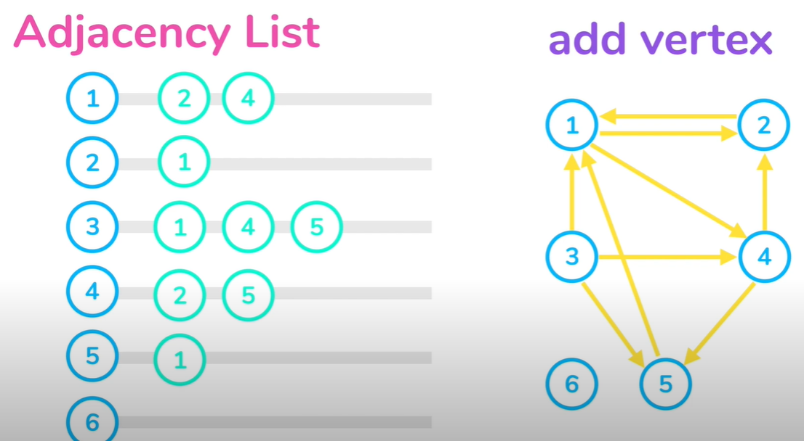
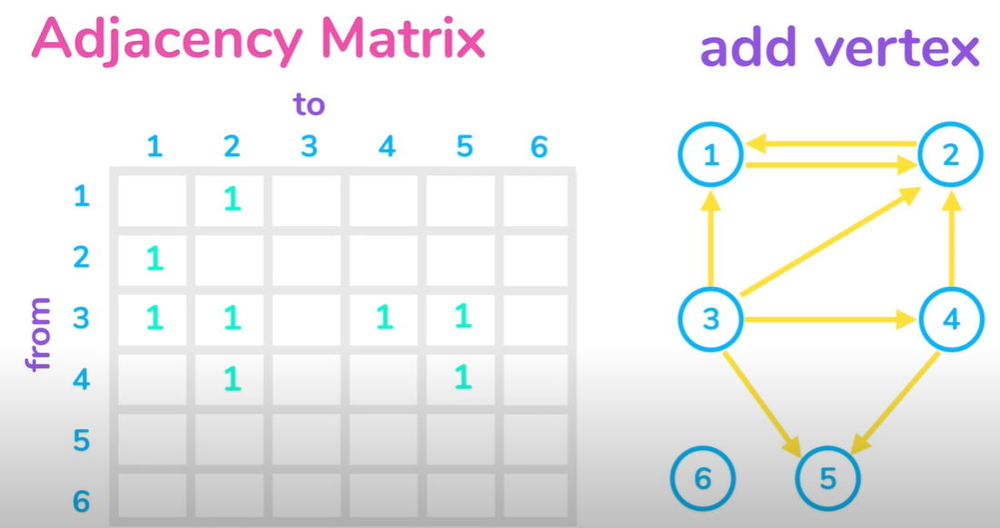

#### Adjacency Matrix vs Adjacency List:

**V is a number of vertices**
**Space**

You always need V square space where V is a number of vertices.

**Edge Lookup**

Constant time for Matrix because we just need to do the array look up.

For List you need to travel a list of adjacent vertices which in the worst case it would need v step.

**Add vertex**

Easy in List because we just need an element to list.

But in Matrix we need to copy the whole array to add new dimensions to the matrix.

**Remmove vertex**

Same with add vertex. We need to copy the array to have a new array.

**Add Edge**

Both constant time

**Delete Edge**
Same for add edge for matrix. But for ad-list, you need to travel to find the edge => 0(V)


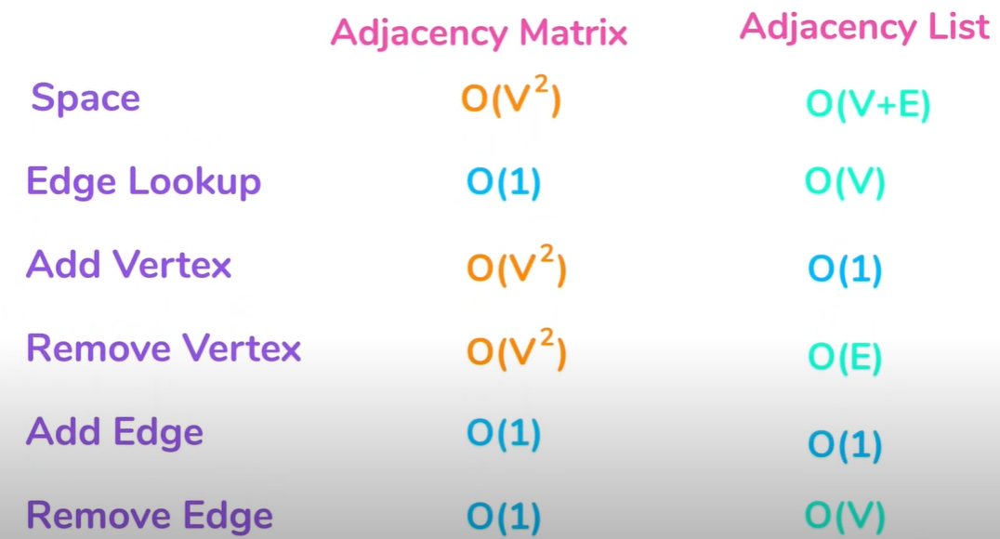


#### Implement
```go
package main

import (
	"fmt"
)

// Graph represents an adjacency list graph
type Graph struct {
	vertices []*Vertex
}

// Vertex represent sgraph vertex
type Vertex struct {
	key      int
	adjacent []*Vertex
}

// Add Vertex to the Graph
func (g *Graph) AddVertex(k int) {
	if contains(g.vertices, k) {
		err := fmt.Errorf("Vertex %v not added because it is an existing key", k)
		fmt.Println(err.Error())
	} else {
		g.vertices = append(g.vertices, &Vertex{key: k})
	}
}

// AddEdge adds an edge to the graph
func (g *Graph) AddEdge(from, to int) {
	// get vertex
	fromVertex := g.getVertex(from)
	toVertex := g.getVertex(to)
	// check error
	// check if either from or to vertex not exist
	if fromVertex == nil || toVertex == nil {
		err := fmt.Errorf("Invalid edge (%v -->%v)", from, to)
		fmt.Println(err.Error())
	} else if contains(fromVertex.adjacent, to) {
		err := fmt.Errorf("Existing edge (%v -->%v)", from, to)
		fmt.Println(err.Error())
	} else {
		// add edge
		fromVertex.adjacent = append(fromVertex.adjacent, toVertex)
	}
}

// GetVertex returns a pointer to the Vertex with a key integer

func (g *Graph) getVertex(k int) *Vertex {
	for i, v := range g.vertices {
		if v.key == k {
			return g.vertices[i]
		}
	}
	return nil
}

// contains
func contains(s []*Vertex, k int) bool {
	for _, v := range s {
		if k == v.key {
			return true
		}
	}
	return false
}

// Print will print the adjacent list for each vertex of the graph
func (g *Graph) Print() {
	for _, v := range g.vertices {
		fmt.Printf("\nVertex %v : ", v.key)
		for _, v := range v.adjacent {
			fmt.Printf("%v ", v.key)
		}
	}
}

func main() {
	test := &Graph{}

	for i := 0; i < 5; i++ {
		test.AddVertex(i)
	}

	test.AddVertex(0)
	test.AddVertex(0)

	test.AddEdge(1, 2)
	test.AddEdge(6, 2)
	test.AddEdge(1, 2)
	test.AddEdge(2, 4)
	test.AddEdge(1, 3)

	test.Print()
}
```

```go
Vertex 0 not added because it is an existing key
Vertex 0 not added because it is an existing key
Invalid edge (6 -->2)
Existing edge (1 -->2)

Vertex 0 :
Vertex 1 : 2 3
Vertex 2 : 4
Vertex 3 :
Vertex 4 :
```
### Pointers

\*:

* `*int`: this whole thing is a type(pointer type, `int` is a base)
* `*p`: \* in front of variable => operator returns what p is pointing to (print value the pointer pointing to - dereferencing)
* value of p is now the address of the value

```go
package main

import "fmt"

func main() {
 i, j := 42, 2701

 p := &i
 fmt.Println(*p) // 42
 fmt.Printf("%T\n", p)
 *p = 21        // change value of i, still keep the address of i
 fmt.Println(i) // print 21

 p = &j         // now point to j
 *p = *p / 37   // change value of j, still keep the address of j
 fmt.Println(j) // 73
}
```

Why you pointer? Because you can access the variable through pointer from different part of the program rather than copy it each time you use or want to manipulate.

Goroutines: independent path of execution - stack of memory

```go
func main(){
	a :=4
	squareVal(a)
}

func squareVal(v int)  {
    v *= v
	fmt.Println(&v,v)
}
```

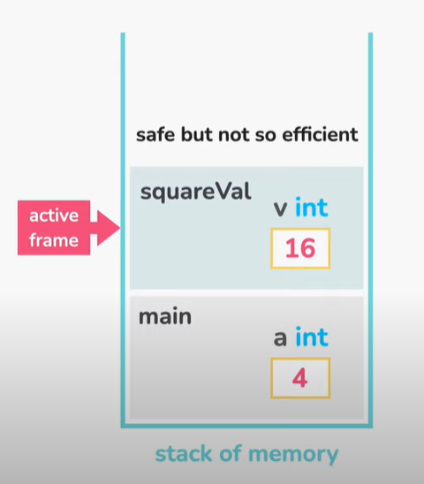

They are isolated frames.

After squareVal create a copy of `a` => `v` with value of 16, when the active frame return to main, `a` still has the value of 4.

```go
func main(){
    a :=4
    squareAdd(&a)
}

func squareAdd(p *int){
	*p *= *p
	fmt.Println(p,*p)
}
```

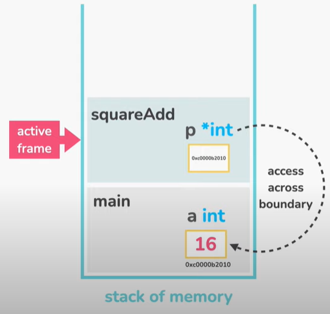

### return `m` (value) and `&m` (pointer)

```go
package main

import "fmt"

type person struct {
	name string
	age  int
}

func initPerson() person {
	m:= person{name:"noname", age:50}
	return m
}

func main()  {
	fmt.Println(initPerson())
}
```

When we call initPerson, we create `m`. Then you change the value of `m`, because of the isolation characteristic. We can not send `m` to the `main()` function. Instead, we make a copy of `m`.

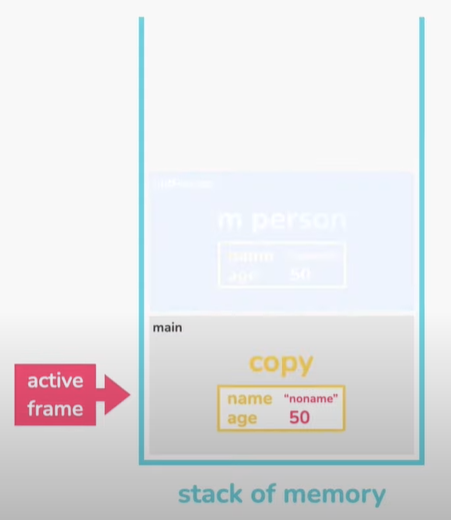

Let's return the address of `m`

```go
func initPerson() *person {
       m:= person{name:"noname", age:50}
	   fmt.Printf("initPerson -> %p\n",&m)
       return &m
}

func main()  {
	fmt.Println(initPerson())
    fmt.Printf("main -> %p\n",initPerson())
}
```

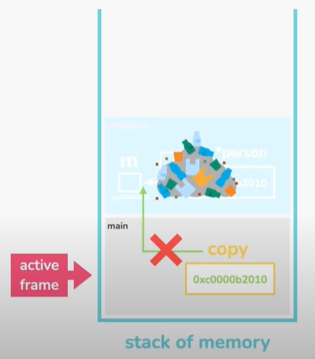

We have an address pointing to `m`, but when the `initPerson()` function finish. That frame is become invalid so the address we copied into the active frame is useless. That where heaps come in so heaps is going to solve this problem for us. The name heaps is different from data structure heaps.

The compiler will analyze what's going on and figures out that this may cause the problem and copy `m` to the heap. Then the `initPerson()` function will return the address of `m` in the heap. After the return when the address of `m` is copied to the frame of the `main()` function. We would be able to access 'm\` with that address.

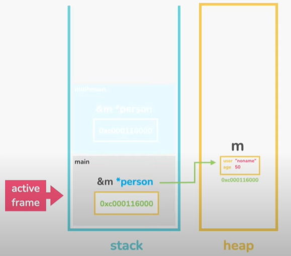

### Garbage Collector

We are doing this in the cost of heap allocation. Which can be a burden for the garbage collector and it can cost us performance.

Stacks don't need garbage collector because it is self-cleaning. When function is called and finish, it will discards the frame and everything inside it. When another function is called, the space will be used by other frames.

If we put something in the heap, that will create job for the garbage collector.

There is a specific algorithms for the garbage collector automatically sets the memory free for ones that we don't use and just keep the ones that we need.

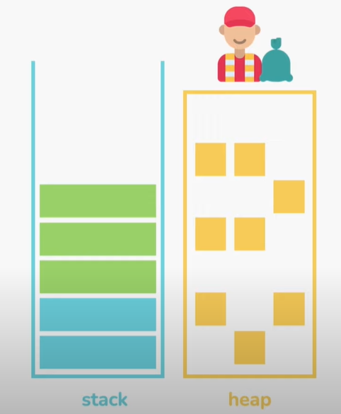

#### Few notes

Few notes from [Golang Tutorial 2 - Learn how go works with the hello world code by Junmin Lee](https://www.youtube.com/watch?v=7PMEbo5Ryeg\&t=129s)

C++, Go, Java, Python: High Level Languages, which means human-readable.

Human -> Machine: Compile (Convert human to machine-readable code).

For example, when finishing a program, **compiler** will transform it to an executable file (file.exe).

A package is a collection of source files in the same directory that are compiled together.

A module is a collection of related go packages that are released together.

#### References

* [Data Structures in Golang by Junmin Lee](https://www.youtube.com/playlist?list=PL0q7mDmXPZm7s7weikYLpNZBKk5dCoWm6)